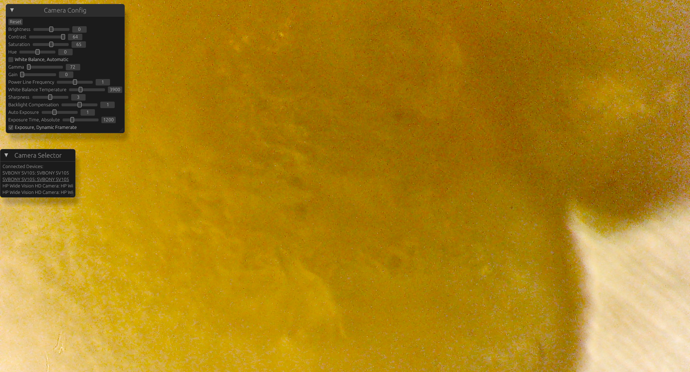
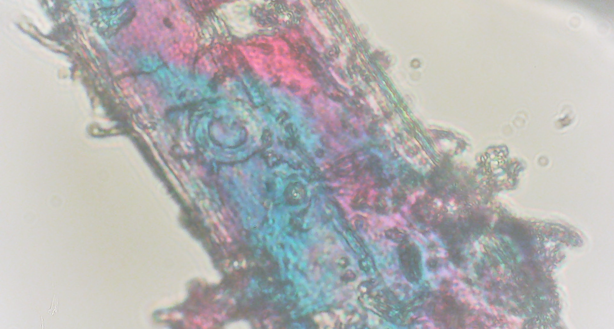

# camera_rs

I wanted a project to read my camera and use my microscope!

I ended up with a project where you can select any device exposed via v4l and use most of the options of the devices, here is how it looks:

Use with ``cargo run --release``

